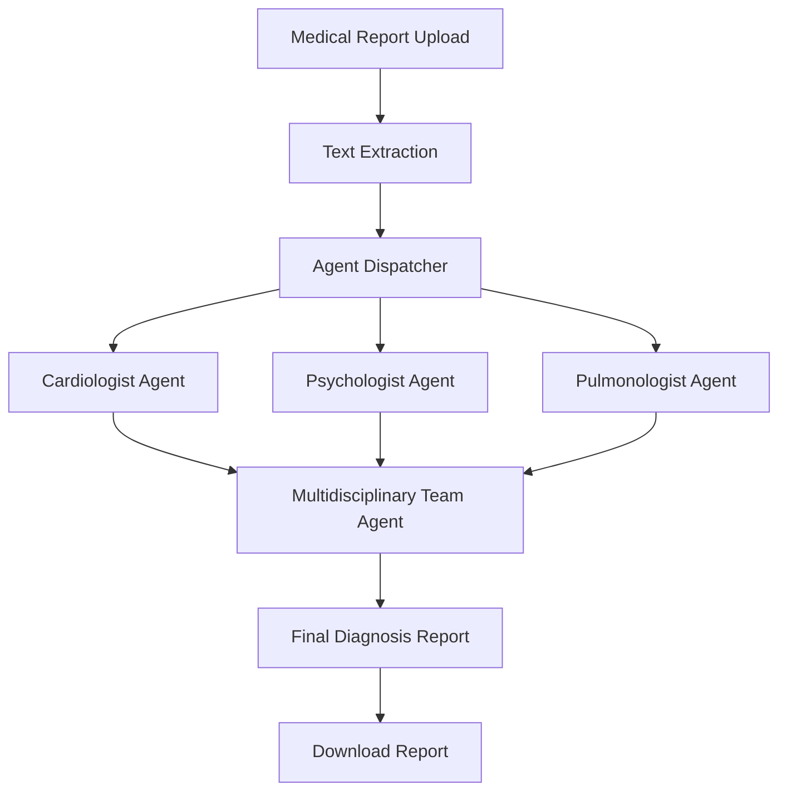

# 🏥 AI-Agents-for-Medical-Report-Analysis

[](https://www.python.org/downloads/)
[](https://opensource.org/licenses/MIT)
[](https://streamlit.io/)
[](https://langchain.com/)

> **MediSynth AI** is an advanced multi-agent system that leverages artificial intelligence to provide comprehensive medical report analysis through specialized AI agents acting as Cardiologist, Psychologist, and Pulmonologist, culminating in a multidisciplinary team diagnosis.

## ✨ Features

- 🤖 **Multi-Agent Architecture** - Specialized AI agents for different medical disciplines
- 📄 **File Upload Support** - PDF and TXT medical report processing
- 🔄 **Concurrent Processing** - Parallel analysis by multiple specialists
- 📊 **Interactive Dashboard** - Modern Streamlit-based user interface
- 📥 **Report Generation** - Downloadable comprehensive analysis reports
- 🔒 **Secure API Management** - Protected Google API key handling
- ⚡ **Real-time Progress** - Live updates during analysis process

## 🏗️ Architecture



## 🚀 Quick Start

### Prerequisites

- Python 3.8 or higher
- Google AI Studio API Key ([Get it here](https://ai.google.dev))

### Installation

1. **Clone the repository**
   ```bash
   git clone https://github.com/yourusername/medisynth-ai.git
   cd medisynth-ai
   ```

2. **Install dependencies**
   ```bash
   pip install -r requirements.txt
   ```

3. **Set up API Key**
   
   **Option 1: Environment File (Recommended)**
   ```bash
   # Create apikey.env file
   echo "GOOGLE_API_KEY=your_google_api_key_here" > apikey.env
   ```
   
   **Option 2: Manual Input**
   - Leave apikey.env empty
   - Enter API key via Streamlit sidebar when prompted

4. **Run the application**
   ```bash
   streamlit run streamlit_app.py
   ```

5. **Access the application**
   - Open your browser and navigate to `http://localhost:8501`

## 📋 Requirements

### Core Dependencies

```txt
streamlit>=1.28.0
langchain-core>=0.1.0
langchain-google-genai>=1.0.0
python-dotenv>=1.0.0
PyPDF2>=3.0.0
```

### Development Dependencies

```txt
pytest>=7.0.0
black>=23.0.0
flake8>=6.0.0
```

## 📁 Project Structure

```
medisynth-ai/
├── streamlit_app.py          # Main Streamlit application
├── Utils/
│   └── Agents.py            # AI Agent classes
├── Medical Reports/         # Sample medical reports (optional)
├── results/                 # Output directory for batch processing
├── requirements.txt         # Python dependencies
├── apikey.env              # API key configuration (create this)
├── README.md               # Project documentation
└── .gitignore             # Git ignore rules
```

## 🔧 Configuration

### API Key Setup

1. **Get Google AI Studio API Key**
   - Visit [Google AI Studio](https://ai.google.dev)
   - Create a new project or select existing one
   - Generate API key for Gemini model access

2. **Configure Environment**
   ```bash
   # In apikey.env file
   GOOGLE_API_KEY=your_actual_api_key_here
   ```

### Model Configuration

The system uses **Gemini 1.5 Flash** model which provides:
- Free tier: 1,500 requests per day
- Fast response times
- Reliable medical text analysis

## 📊 How It Works

### 1. **Upload Phase**
- Users upload medical reports (PDF/TXT format)
- System extracts and preprocesses text content
- Validates file format and content structure

### 2. **Analysis Phase**
```python
# Concurrent specialist analysis
Cardiologist Agent    →  Cardiac assessment
Psychologist Agent    →  Mental health evaluation  
Pulmonologist Agent   →  Respiratory analysis
```

### 3. **Synthesis Phase**
- Multidisciplinary team agent reviews all specialist reports
- Generates comprehensive diagnosis with possible health issues
- Provides evidence-based recommendations

### 4. **Output Phase**
- Interactive web display of all analyses
- Downloadable comprehensive report
- Timestamped results for record keeping

## 💡 Usage Examples

### Web Interface Usage

1. **Launch Application**
   ```bash
   streamlit run streamlit_app.py
   ```

2. **Upload Medical Report**
   - Click "Choose a medical report file"
   - Select PDF or TXT file
   - Preview content in expandable section

3. **Run Analysis**
   - Click "Start Analysis" button
   - Monitor real-time progress
   - View specialist reports as they complete

4. **Download Results**
   - Review comprehensive analysis
   - Click "Download Analysis Report"
   - Save timestamped report file

### Programmatic Usage

```python
from Utils.Agents import Cardiologist, Psychologist, Pulmonologist, MultidisciplinaryTeam

# Load medical report
with open("medical_report.txt", "r") as file:
    report = file.read()

# Initialize agents
cardiologist = Cardiologist(report, api_key="your_api_key")
psychologist = Psychologist(report, api_key="your_api_key")
pulmonologist = Pulmonologist(report, api_key="your_api_key")

# Get individual analyses
cardiac_analysis = cardiologist.run()
mental_analysis = psychologist.run()
respiratory_analysis = pulmonologist.run()

# Generate final diagnosis
team = MultidisciplinaryTeam(
    cardiac_analysis, 
    mental_analysis, 
    respiratory_analysis,
    api_key="your_api_key"
)
final_diagnosis = team.run()
```

## 🛠️ Development

### Setting up Development Environment

```bash
# Clone repository
git clone https://github.com/yourusername/medisynth-ai.git
cd medisynth-ai

# Create virtual environment
python -m venv venv
source venv/bin/activate  # On Windows: venv\Scripts\activate

# Install development dependencies
pip install -r requirements.txt
pip install -r requirements-dev.txt

# Run tests
pytest tests/

# Code formatting
black .
flake8 .
```

### Adding New Agent Types

1. **Create Agent Class**
   ```python
   class NewSpecialist(Agent):
       def __init__(self, medical_report, api_key=None):
           super().__init__(medical_report, "NewSpecialist", api_key=api_key)
   ```

2. **Add Prompt Template**
   ```python
   "NewSpecialist": """
       Act like a [specialist type]. 
       Task: [specific analysis task]
       Focus: [key areas to analyze]
       Medical Report: {medical_report}
   """
   ```

3. **Update UI and Processing Logic**

## 📈 Performance

- **Response Time**: 30-60 seconds for complete analysis
- **Concurrent Processing**: 3 agents run simultaneously
- **File Size Limit**: Up to 10MB for PDF files
- **Daily Quota**: 1,500 requests (Google AI Studio free tier)

## 🔒 Security & Privacy

- ✅ API keys are securely handled and never logged
- ✅ Medical reports are processed in memory only
- ✅ No permanent storage of sensitive data
- ✅ Files are automatically cleaned up after processing
- ⚠️ **Disclaimer**: This tool is for educational purposes only

## 🤝 Contributing

1. **Fork the repository**
2. **Create feature branch** (`git checkout -b feature/amazing-feature`)
3. **Commit changes** (`git commit -m 'Add amazing feature'`)
4. **Push to branch** (`git push origin feature/amazing-feature`)
5. **Open Pull Request**

### Contribution Guidelines

- Follow PEP 8 coding standards
- Add tests for new features
- Update documentation as needed
- Ensure all tests pass before submitting PR

## 📄 License

This project is licensed under the MIT License - see the [LICENSE](LICENSE) file for details.

## 🆘 Support & Troubleshooting

### Common Issues

**Issue**: "API key not found" error
```bash
Solution: Ensure apikey.env file exists with GOOGLE_API_KEY=your_key
```

**Issue**: "ModuleNotFoundError" for Utils.Agents
```bash
Solution: Ensure you're running from the project root directory
```

**Issue**: PDF text extraction fails
```bash
Solution: Ensure PDF is text-based, not scanned images
```

### Getting Help

- 📧 **Email**: ujwalakusma26@gmail.com
- 💬 **Issues**: [GitHub Issues](https://github.com/U0426jwala/AI-Agents-for-Medical-Report-Analysis.git)

## 🙏 Acknowledgments

- **Google AI Studio** for providing Gemini API access
- **LangChain** for agent framework capabilities
- **Streamlit** for the amazing web app framework
- **Medical Community** for inspiration and use case validation

## 📚 Citations

> **Important Medical Disclaimer**: This application is designed for educational and research purposes only. It should not be used as a substitute for professional medical advice, diagnosis, or treatment. Always seek the advice of qualified healthcare providers with any questions regarding medical conditions.

---

<div align="center">

**Made with ❤️ for advancing AI in Healthcare**

[⭐ Star this repo](https://github.com/yourusername/medisynth-ai) | [🐛 Report Bug](https://github.com/yourusername/medisynth-ai/issues) | [💡 Request Feature](https://github.com/yourusername/medisynth-ai/issues)

</div>
